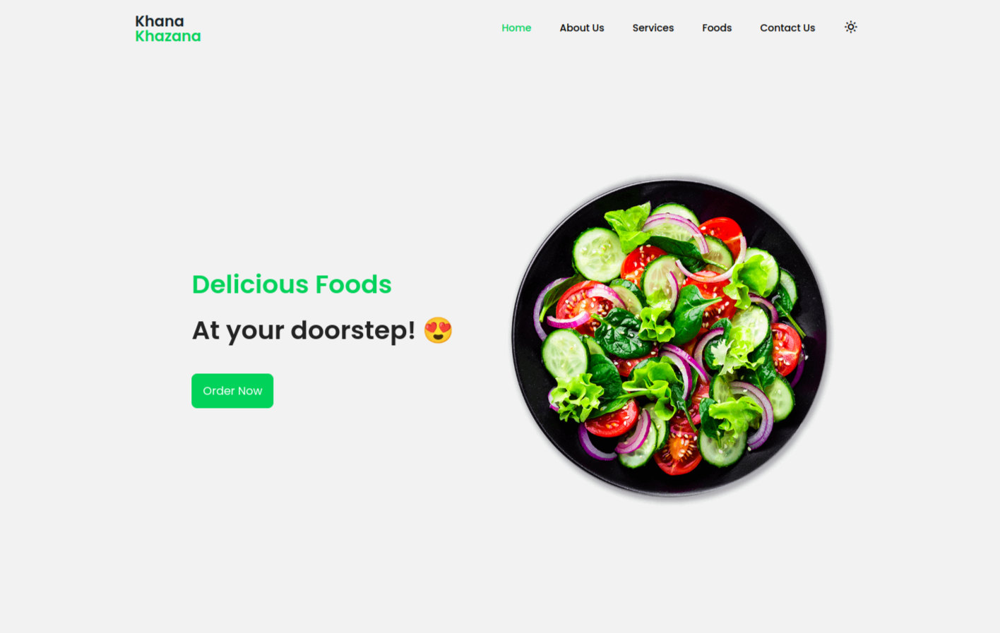
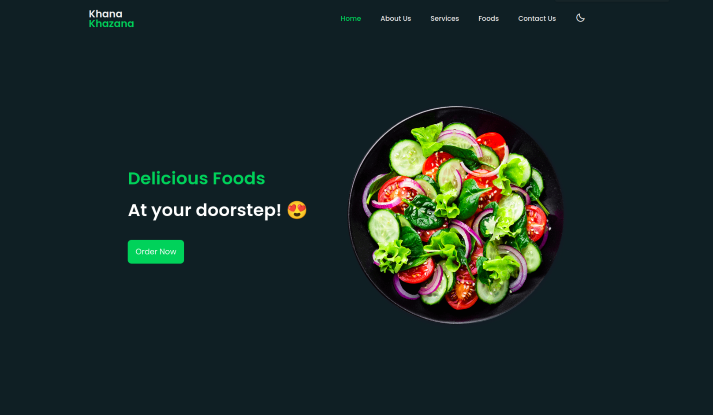
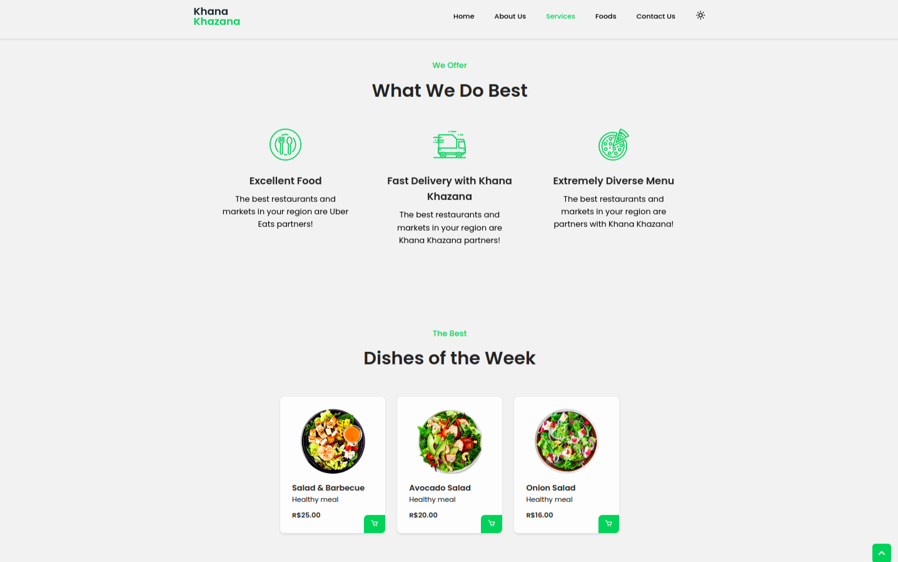
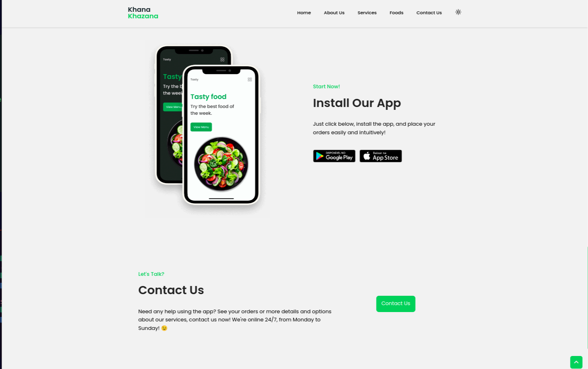

# Khana Khazana - Food App Landing Page

Welcome to Khana Khazana, a fully responsive food app interface (Landing Page) that showcases various sections to entice users. This project is created using HTML, CSS, and JS to provide a visually appealing and user-friendly experience.

<!---->
<div align="center">

</div>

<div align="center">

</div>
<div align="center">

</div>
<div align="center">

</div>


## Preview

For a live preview of the Khana Khazana app, visit [Khana Khazana - Live Preview](https://dreamy-baklava-f1e83b.netlify.app/)

## Features

- **Responsive Design:** The landing page is designed to be fully responsive, providing an optimal viewing experience across a wide range of devices.
- **Interactive Sections:** Engaging sections such as Home, About Us, Services, Featured Dishes, App Installation, and Contact Us.
- **Diverse Menu:** Displaying a variety of dishes with images, names, details, and prices.
- **App Installation:** Encourages users to install the app with visual cues and download links.
- **Contact Us:** An interactive section with information on how to get in touch with the Khana Khazana team.
- **Dark Mode Support:** Enjoy a comfortable browsing experience with the option to switch to dark mode.

## How to Use

### Download the Code

1. Clone the repository using Git:

   ```bash
   git clone https://github.com/princeyadav00785/Khana_Khazana.git
   ```

2. Or download the ZIP file by clicking [here](https://github.com/princeyadav00785/Khana_Khazana/archive/main.zip) and extract it to your desired location.

### Run the Project

1. Open the project folder in your preferred code editor.
2. Locate the `index.html` file and open it in a web browser to view the landing page.

## Contributing

If you'd like to contribute to Khana Khazana, feel free to fork the repository and submit pull requests.

## Issues and Feedback

If you encounter any issues or have feedback, please [open an issue](https://github.com/princeyadav00785/Khana_Khazana/issues) on the GitHub repository.

Enjoy exploring the Khana Khazana app landing page, now with the added feature of Dark Mode support!
